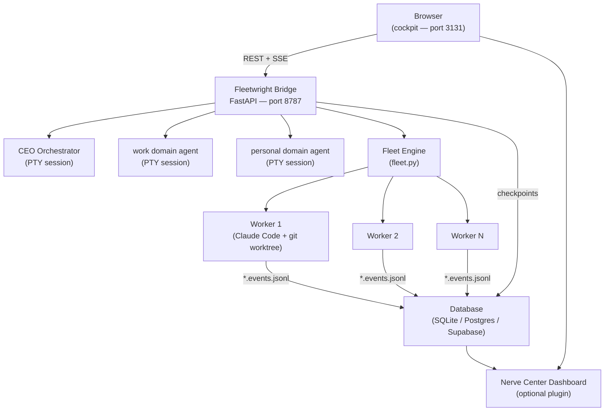
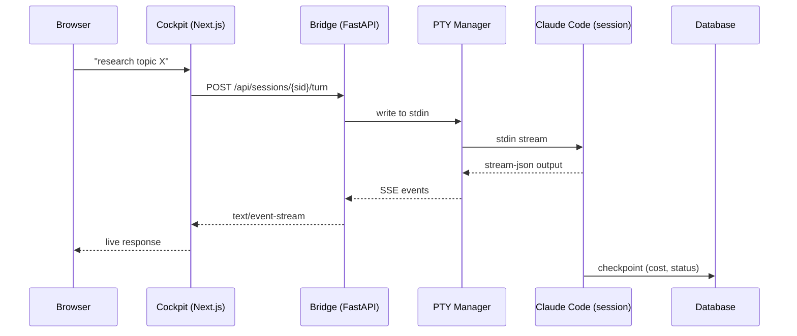
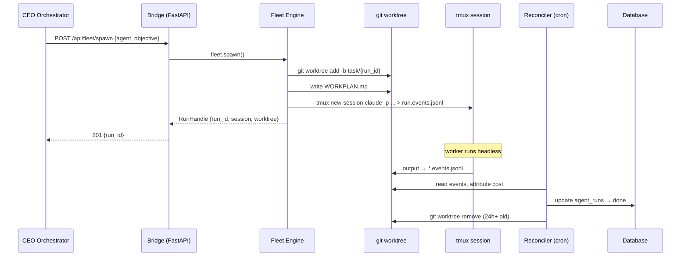

# Architecture

Fleetwright has five components that work together as a single system.

---

## System overview

---

## Component map

| # | Component | Location | Role |
|---|-----------|----------|------|
| a | **CEO Orchestrator** | `fleetwright/orchestrator/` | Always-on lead agent: holds goals, routes work, synthesizes results |
| b | **Fleet Engine** | `fleetwright/fleet/` | Spawn / supervise / reconcile parallel Claude Code workers |
| c | **Bridge** | `fleetwright/bridge/` | FastAPI server: PTY lifecycle, REST + SSE API, domain registry |
| d | **Cockpit** | `cockpit/` | Next.js supervision UI: sessions, fleet runs, domain status |
| e | **Agent Framework** | `fleetwright/sdk/` + `agents/` | Shared SDK, agent definitions, inter-agent messaging |

---

## Data flow: a user turn

---

## Data flow: a fleet spawn

---

## Module reference

### (a) CEO Orchestrator — `fleetwright/orchestrator/`

| Module | Role |
|---|---|
| `orchestrator.py` | Plan → fanout → harvest → synthesize loop |
| `plan_file.py` | Read/write `WORKPLAN.md` — the agent's persistent state |
| `agents/examples/ceo/CLAUDE.md` | CEO system prompt — copy to `~/.claude/agents/ceo.md` |

### (b) Fleet Engine — `fleetwright/fleet/`

| Module | Role |
|---|---|
| `fleet.py` | Core supervisor: spawn, list, cancel, reap |
| `run_reconciler.py` | Cron reconciler: close finished runs, attribute cost, GC worktrees |
| `checkpoints.py` | Checkpoint store: SQLite (default), Postgres, or Supabase adapters |
| `event_ingest.py` | Parse `*.events.jsonl` → cost + outcome |
| `multitask.py` | High-level parallel spawn: N workers, wait for all, return results |
| `drainer.py` | Drainer daemon: pull from a queue and spawn workers at a controlled rate |

### (c) Bridge — `fleetwright/bridge/`

| Module | Role |
|---|---|
| `main.py` | FastAPI app entrypoint — loads routes, CORS, health check |
| `pty_manager.py` | PTY lifecycle: spawn Claude Code in a pty, stream stdin/stdout |
| `domain_registry.py` | YAML-driven domain registry: load `config/domains.yaml`, track sessions |
| `routes/sessions.py` | Session CRUD + SSE turn endpoint |
| `routes/fleet.py` | Fleet REST API: spawn, list, cancel, status |
| `routes/agents.py` | Agent registry endpoint |
| `routes/domains.py` | Domain status endpoint |

### (d) Agent Framework — `fleetwright/sdk/`

| Module | Role |
|---|---|
| `claude_cli_client.py` | `claude -p` wrapper — one-shot LLM completions |
| `ask_agent.py` | Inter-agent messaging — query any domain agent or CEO by name |
| `circuit_breaker.py` | Rate-limit and back-off for external calls |
| `model_registry.py` | Tier registry — map `"agent"` → model ID |
| `notify.py` | Notification helper — log to stderr + optional Telegram push |
| `errors.py` | Shared error types |

---

## Key interfaces

| Interface | Transport | Auth |
|---|---|---|
| Browser ↔ Bridge | REST + SSE at `http://localhost:8787` | HMAC-JWT (`BRIDGE_SECRET`) |
| Cockpit → Bridge | Server-side fetch (no browser auth) | Bearer token |
| Bridge ↔ DB | SQLite / Postgres / Supabase client | Connection string / service key |
| Agent ↔ Agent | `ask_agent.py` → `/api/sessions/{sid}/turn` | `BRIDGE_SECRET` |
| Fleet ↔ Workers | tmux + git worktrees | None (local process) |

---

## Core vs optional-plugin

### Core (required)

- Fleet engine
- PTY bridge
- `/chat` cockpit
- Agent framework + CEO
- Domain registry

### Optional plugin (ships in box, can be disabled)

- **Nerve Center Dashboard** — tasks, projects, CRM, org chart, run history. Disable by not running the cockpit's Nerve Center routes.
- **Example domain agents** — `work` and `personal` are demos. Replace with your own.
- **MCP integrations** — calendar, Telegram operator, health data sync. Configure via `.env` / MCP config; absent if not configured.

---

## Install tiers

| Tier | Components | Use case |
|------|------------|----------|
| **minimal** | Fleet engine + agent framework | Developers who just want the parallel-agent spawner |
| **full** | All five | The intended Fleetwright experience |
